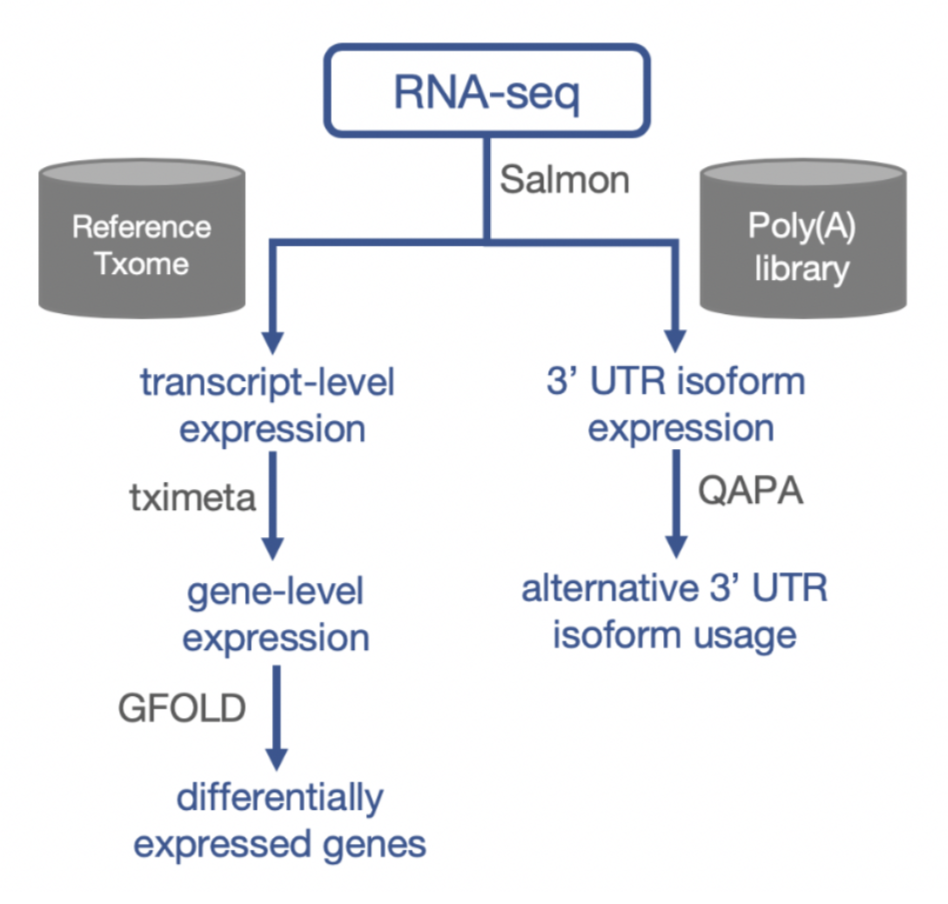

# 3primeUTR-HNSC
_This is a collaboration project._

Here we aim to characterize the landscape of 3'UTR in ER-stressed heck and neck cancer cell lines, to see if any interesting findings in alternative polyadenlyation events. These scripts and the report are the demo with a public dataset when I built the pipeline using RNA-seq. The sample size is only 1 due to some limitation...

 
 

    

Have a glance at my [report](https://github.com/chilampoon/3primeUTR-HNSC/blob/master/APA_workflow_chilam.pdf).
